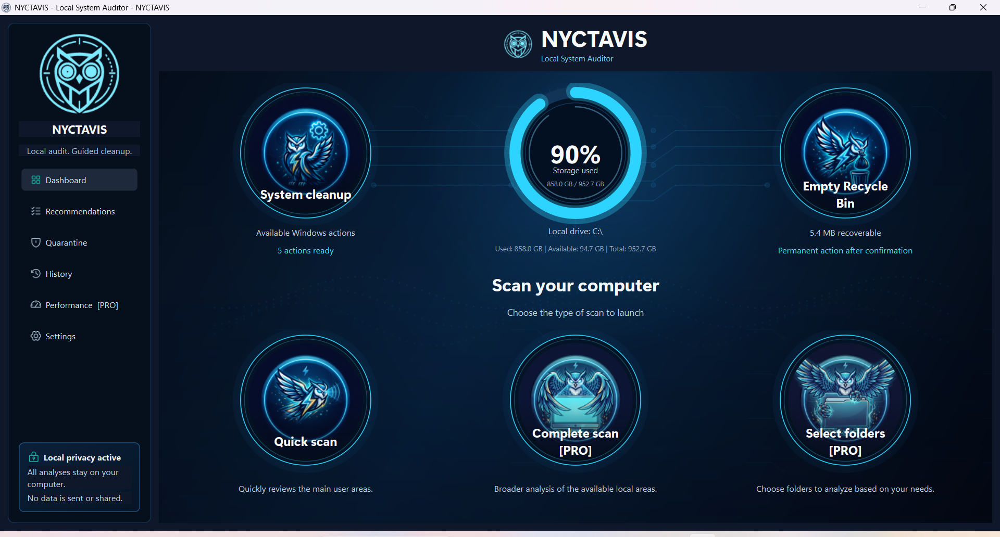
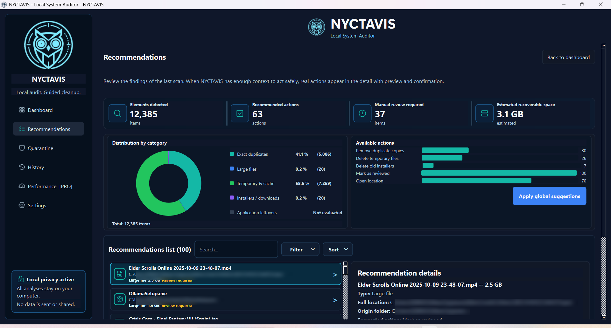
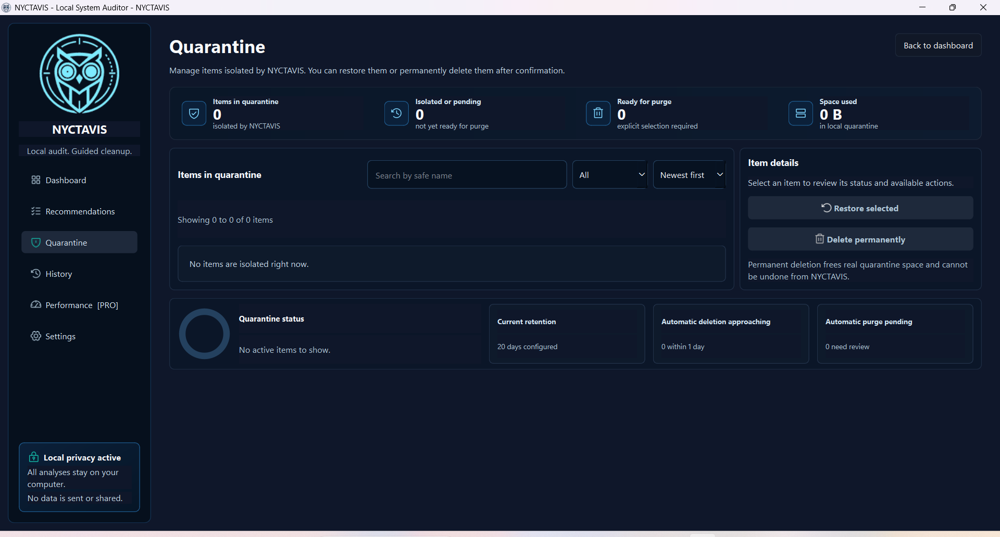

# NYCTAVIS

### Scan smart. Clean safely.

**A local-first Windows utility that finds junk, duplicate files and reclaimable space — and cleans only what you approve.**

[**Website**](https://nyctavis.com) · [**App**](https://nyctavis.app) · [**Report an issue**](../../issues) · [**Get notified**](https://nyctavis.com/#cta)

---

## 🦉 What is NYCTAVIS?

NYCTAVIS is a desktop app for Windows that helps you understand and reclaim your disk space — safely. It scans your system, surfaces junk and true duplicates, and guides you through a cleanup where **nothing is removed without your confirmation**. Everything runs **on your computer**: no cloud upload, no telemetry, no account.

> **Coming soon to the Microsoft Store** — free tier + optional Pro. Star this repo to hear about the launch first.

## ✨ Features

- 🔍 **Deep disk scan** — quick, full or folder-picked, to map exactly what's using your space.
- 🧬 **Duplicate finder** — content-based hashing detects real duplicates, even with different names.
- 🧹 **Guided cleanup** — temp files, caches, old installers, app residue and recycle bin, via Windows Disk Cleanup.
- 💾 **Reclaim space** — see how many gigabytes you can safely recover and get them back in a click.
- 🛡️ **Safe by default** — reversible quarantine and explicit confirmation before anything is deleted.
- 🔒 **Private & local** — no cloud, no telemetry, no account.
- 🌐 **Trilingual** — English, Español, Français.

## 📸 Screenshots

> Replace the placeholders below by dropping your real screenshots into `assets/` with these names.

| Dashboard | Recommendations | Quarantine |
|---|---|---|
|  |  |  |

## ⬇️ Download

NYCTAVIS is launching on the **Microsoft Store**. Until then:

- ⭐ **Star** this repository to be notified.
- 📩 **Get notified by email** from the [website](https://nyctavis.com/#cta).
- 🧪 Pre-release builds (when available) will be published under [**Releases**](../../releases).

> Windows 10 / 11 (64-bit).

## 🔒 Privacy first

NYCTAVIS is **local-first by design**:

- **No cloud** — analysis happens entirely on your machine.
- **No telemetry** — we don't track what you scan or delete.
- **No account** — install and use it, no sign-up.
- **Reversible** — quarantine lets you restore anything before it's gone.

## 💬 Support & feedback

- 🐞 Found a bug? [Open an issue](../../issues/new/choose).
- 💡 Have an idea? [Request a feature](../../issues/new/choose).
- 📧 Contact: **hello@nyctavis.com**

## ❓ FAQ

**Is it free?** There will be a free tier and an optional Pro upgrade. Pricing announced at launch.
**Is my data safe?** Yes — everything runs locally, nothing is uploaded.
**Does it delete files automatically?** No — explicit confirmation + reversible quarantine.
**Which Windows?** 64-bit Windows 10 and 11.

---

## ℹ️ About this repository

This is the **public showcase & support hub** for NYCTAVIS — it hosts the marketing website, screenshots, releases and issue tracker. **NYCTAVIS is a proprietary, closed-source product; the application source code is not published here.**

© 2026 NYCTAVIS. All rights reserved. "NYCTAVIS" and the owl logo are trademarks of their owner (registration pending). See [LICENSE](LICENSE).
